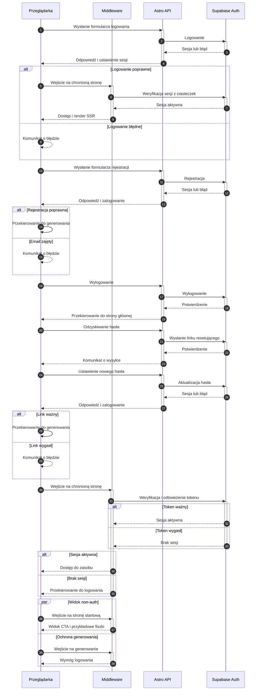

<authentication_analysis>
1. Przepływy autentykacji:
   - Rejestracja z automatycznym logowaniem i przekierowaniem.
   - Logowanie z przekierowaniem do widoku generowania.
   - Wylogowanie i przekierowanie do strony głównej.
   - Odzyskiwanie hasła z linkiem email i ustawieniem nowego hasła.
   - Weryfikacja sesji przy SSR i ochrona widoków.
   - Odświeżanie tokenu i reakcja na wygaśnięcie sesji.
   - Dostęp non-auth do przykładowych fiszek bez zapisu.

2. Główni aktorzy i interakcje:
   - Przeglądarka: inicjuje formularze i nawigację.
   - Middleware: weryfikuje sesję i chroni trasy.
   - Astro API: obsługuje endpointy auth.
   - Supabase Auth: realizuje logowanie, rejestrację i reset.

3. Procesy weryfikacji i odświeżania tokenów:
   - Middleware odczytuje sesję z ciasteczek.
   - Przy wygaśnięciu tokenu następuje odświeżenie.
   - Brak odświeżenia skutkuje przekierowaniem do logowania.

4. Krótki opis kroków:
   - UI zbiera dane i wysyła do API.
   - API deleguje do Supabase Auth.
   - Supabase zwraca sesję lub błąd.
   - Middleware chroni trasy i dopuszcza tylko zalogowanych.
   - Reset hasła używa linku email i aktualizacji hasła.
</authentication_analysis>

<mermaid_diagram>

</mermaid_diagram>
