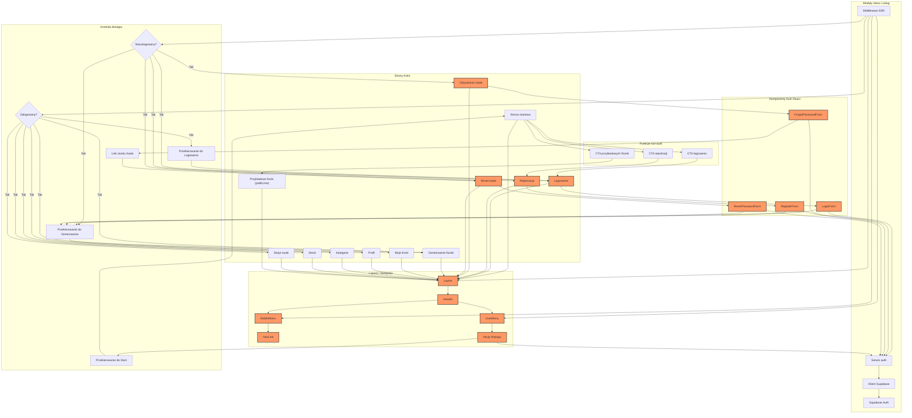

<architecture_analysis>
Komponenty i elementy z dokumentów:
- Strony Astro: Strona logowania, Strona rejestracji, Strona odzyskania hasła, Strona resetu hasła.
- Komponenty React auth: LoginForm, RegisterForm, ForgotPasswordForm, ResetPasswordForm, indeks eksportów.
- Layout i nawigacja: Layout, UserMenu, MobileMenu, NavLink.
- Widoki produktu: Strona startowa z CTA logowania, rejestracji i przykładowych fiszek, widok generowania fiszek, widok fiszek, profil, kategorie, decki, sesje nauki.
- Moduły stanu: middleware SSR z isAuthenticated, klient Supabase, serwis auth.

Główne strony i komponenty:
- Strona startowa korzysta z Layout i nawigacji oraz CTA do logowania i rejestracji.
- Strony logowania i rejestracji zawierają Layout i pojedynczy formularz React.
- Strony odzyskania i resetu hasła obsługują odzyskiwanie dostępu.
- Widoki chronione (generowanie, fiszki, profil, kategorie, decki, sesje) opierają się o Layout i stan sesji.

Przepływ danych:
- Middleware SSR pobiera stan sesji i przekazuje isAuthenticated do Layout.
- Middleware SSR steruje dostępem: chronione widoki przekierowują niezalogowanych do logowania, a strony logowania/rejestracji przekierowują zalogowanych do generowania.
- Layout decyduje o wyświetleniu CTA logowania/rejestracji lub UserMenu z akcją wylogowania.
- Formularze logowania, rejestracji i resetu hasła wywołują serwis auth, który komunikuje się z Supabase Auth; sukces przekierowuje do generowania.
- CTA prowadzi do przykładowych fiszek dostępnych dla każdego, bez zapisu postępu na backendzie.

Opis funkcjonalności:
- Layout: wspólny szkielet UI i nawigacja.
- UserMenu: akcje użytkownika, w tym wylogowanie i profil.
- MobileMenu i NavLink: linki nawigacyjne zależne od stanu sesji.
- Formularze auth: walidacja i akcje logowania, rejestracji oraz resetu hasła.
- Middleware SSR: źródło stanu isAuthenticated dla UI.
- Serwis auth i klient Supabase: realizacja przepływów logowania, rejestracji i resetu hasła.
</architecture_analysis>

<mermaid_diagram>

</mermaid_diagram>
